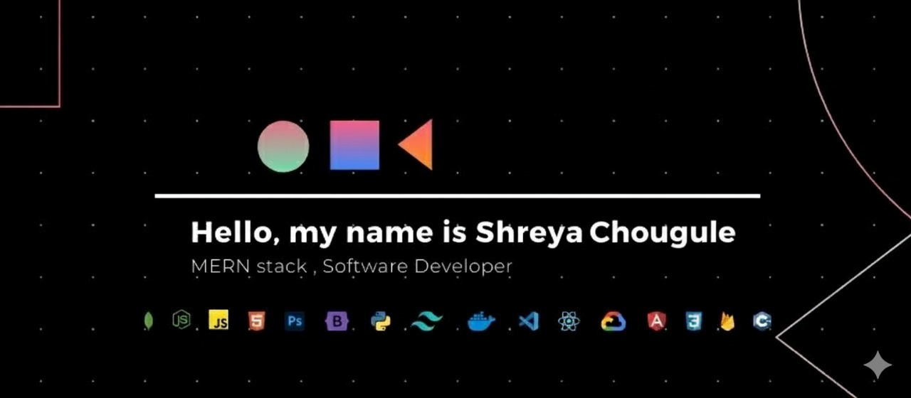

  

###

<h2>Hi, I'm Shreya 👋 </h2>

Focused on AI, data science, and blockchain. I build projects to learn deeply and improve problem solving.

###

<h3>About Me | </h3>

  

    👨‍💻 I am a <a style="color: white; font-weight: bold; text-decoration: none;" href="#">Computer Science Engineering student</a> developing practical skills in 🤖 <a style="color: white; font-weight: bold; text-decoration: none;" href="#">AI, Machine Learning, and Data Science</a>. I focus on breaking down problems, identifying patterns, and 📈 <a style="color: white; font-weight: bold; text-decoration: none;" href="#">refining solutions</a> for efficiency.
   ⛓️ Alongside this, I am diving into <a style="color: white; font-weight: bold; text-decoration: none;" href="#">Blockchain Development</a> and strengthening my 🧠 <a style="color: white; font-weight: bold; text-decoration: none;" href="#">Problem-Solving skills via DSA in C++</a>. My approach is driven by practice, logical thinking, and 🚀 <a style="color: white; font-weight: bold; text-decoration: none;" href="#">continuous improvement</a>.
  

###

### Connect with me |
[LinkedIn](https://www.linkedin.com/in/shreya-chougule-35a120326) | [Portfolio](https://shreyya.vercel.app/) | [Email](mailto:shreyachougule1011@gmail.com)

###